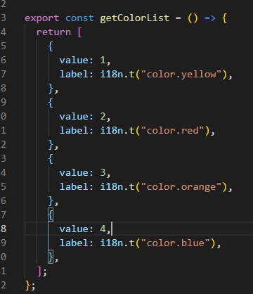
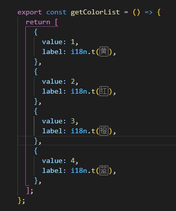

# vue2x-i18n-demo

vue2.x项目框架demo，能满足基本的多语言需求，如对你有帮助，欢迎star。公司项目比较特殊，同时使用了vuetify element-ui，可根据自己项目情况，删除不需要的配置。

###  安装

- element ui 2.x
- vuetify 2.x
- vue 2.x
- vue-i18n 8.x 
- axios

### 配置

1. 在src/i18n/index.js

```javascript
import Vue from "vue";
import VueI18n from "vue-i18n";
import Cookies from "js-cookie";

// 导入本地语言包
import LocaleEn from "./locales/en";
import LocaleZh from "./locales/zh";

// 导入element-ui语言包
import LocaleElementEn from "element-ui/lib/locale/lang/en";
import LocaleElementZH from "element-ui/lib/locale/lang/zh-CN";
import ElementLocale from "element-ui/lib/locale";

// 导入vuetify语言包
import LocaleVuetifyZh from "vuetify/lib/locale/zh-Hans";
import LocaleVuetifyEn from "vuetify/lib/locale/en";

// 注册i18n
Vue.use(VueI18n);

// 语言包根据语言环境分类
const messages = {
  en: {
    ...LocaleEn,
    ...LocaleElementEn,
    $vuetify: {
      ...LocaleVuetifyEn,
    },
  },
  zh: {
    ...LocaleZh,
    ...LocaleElementZH,
    $vuetify: {
      ...LocaleVuetifyZh,
    },
  },
};

// 通过选项创建 VueI18n 实例
const i18n = new VueI18n({
  locale: getLanguage(),
  messages, // 设置语言环境对应信息
});

// 重点，同步切换element ui 组件内部语言
ElementLocale.i18n((key, value) => i18n.t(key, value));

// 设置当前语言环境，默认中文简体
export function getLanguage() {
  const chooseLanguage = Cookies.get("language");
  if (chooseLanguage) return chooseLanguage;
  // 如果没有选择语言，如果都没有，默认中文字
  const language = (
    navigator.language || navigator.browserLanguage
  ).toLowerCase();
  const locales = Object.keys(messages);
  for (const locale of locales) {
    if (language.indexOf(locale) > -1) {
      return locale;
    }
  }
  return "zh";
}

export default i18n;

```

2. element-ui 配置

```javascript

// 上面代码中的这句
ElementLocale.i18n((key, value) => i18n.t(key, value));

```

3. vuetify  配置 src/vuetify/index.js
   
```javascript

import Vue from "vue";
import Vuetify from "vuetify";
import "vuetify/dist/vuetify.min.css";

import i18n, { getLanguage } from "@/i18n";
Vue.use(Vuetify);

export default new Vuetify({
  icons: {
    iconfont: "mdi", // mdi || fa
  },
  // theme: { dark: true },
  theme: {
    themes: {
      light: {
        primary: "#3369ff",
      },
    },
  },
  // vuetity语言配置
  lang: {
    t: (key, ...params) => i18n.t(key, params),
    current: getLanguage(),
  },
});
```
4. 注入src/main.js 

```javascript
import Vue from "vue";
import App from "./App.vue";
import router from "./router";
import store from "./store";

import vuetify from "@/vuetify/index.js";

import ElementUI from "element-ui";
import "element-ui/lib/theme-chalk/index.css";

import i18n from "./i18n"; // 语言包

Vue.config.productionTip = false;
Vue.use(ElementUI);

new Vue({
  router,
  store,
  i18n,
  vuetify,
  render: (h) => h(App),
}).$mount("#app");
```

5. 配置中英文件 src/i18n/locales/zh.js   |   src/i18n/locales/en.js

```javascript
// 支持 js json
// en
{
  "test": "test",
  "message": "hello chinese"
}
//  zh
{
  "test": "测试",
  "message": "你好 中文"
}
```
### 项目替换运用

1. template

```javascript
const messages = {
  en: {
    message: {
      hello: '{msg} world {lang}',
      bye: '{0} world {1}',
      test: 'test'
    }
  }
}
```
```html
  <p>{{ $t('message.hello', { msg: 'hello', lang: 'js'}) }}</p>
  <p>{{ $t('message.bye', ['bye', 'js']) }}</p>
  <!-- 可通过语言做一些特殊的css样式判断，有些英文单词太长！！！ -->
  <p>{{ $i18n.locale}}</p>

```

2. js 
```javascript

export default {
  // 注意，不要使用箭头函数
  data() {
    return {
      form: {
        name: this.$t('test'),
      },
    };
  },
  methods: {
    onSubmit() {
      this.$t('test')
    },
  },
};

// 还有最重要的，外部导入的js，如果不改写函数形式，页面需要reload()才能显示对应的语言   注意，这里是i18n.t()
// src/config/list.js

import i18n from "../i18n";

export const getColorList = () => {
  return [
    {
      value: 1,
      label: i18n.t("color.yellow"),
    },
  ];
};


// 需要location.reload();
export const colorList = [
  {
    value: 1,
    label: i18n.t("color.yellow"),
  },
];

```
3. axios 接口请求

在请求拦截器上面添加request headers
```javascript
import store from "@/store";

//请求拦截器
axios.interceptors.request.use(
  config => {
    // 添加多语言token
    const language = store.state.language;

    if (language) {
      // 英文 Accept-Language:en-US
      // 中文 Accept-Language:zh-CN
      config.headers["Accept-Language"] = language === "zh" ? "zh-CN" : "en-US";
    }
    return config;
  },
  error => {
    console.log(error);
  },
);
```
4. vscode 插件，还原代码可读性 666

安装i18n Ally插件，并配置.vscode/settings.json

[i18n-ally Configurations](https://github.com/lokalise/i18n-ally/wiki/Configurations)
```json
{
  "i18n-ally.localesPaths": [
    "src/i18n",
    "src/i18n/locales"
  ],
  "i18n-ally.enabledParsers": ["ts", "json", "js"],
  "i18n-ally.displayLanguage": "zh",
  "i18n-ally.enabledFrameworks": ["vue", "react"]
}
```





### (项目地址，大佬们来一下 Star)[https://github.com/chenchunfeng/vue2x-i18n-demo]

